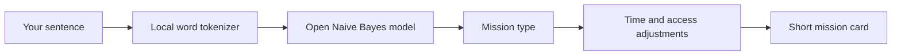

## What I Built

I built **Outside, briefly**, a small outdoor activity planner. You describe your mood in a sentence, choose how much time you have, and get a short mission that sends you outside. The goal is for the screen to be the shortest part of the experience.

I noticed a problem with many wellness apps: even when they encourage a walk, they ask you to keep checking the phone. I wanted the planning step to end quickly. The result gives you a handful of concrete steps and a question to think about when you return. You can print or save the mission card and leave the browser behind.

It offers four kinds of mission: noticing nature, moving, caring for a place, and connecting with someone. There is an accessible or seated option.

## Demo

[Try the live demo](https://ankitpandit120.github.io/outside-briefly/). Type “I want a peaceful walk with birds and trees” to see a noticing mission.

Another example: “I want to water plants in my garden” produces a care mission. The result shows which words influenced the model, so the recommendation is not a mysterious instruction.

## Code

[View the MIT-licensed source code](https://github.com/AnkitPandit120/outside-briefly).

## How I Built It

The AI core is a transparent, locally trained multinomial Naive Bayes classifier. Forty labeled example phrases in `model.js` teach it the four outing types. The model turns input into word tokens, counts how often each token appears in the example phrases, applies Laplace smoothing, and estimates which outing type best fits the sentence. The interface shows matched words so its decision is inspectable. The result is assembled from short mission steps, adjusted for time and accessibility. This is intentionally a small classifier, not a language model.

For instance, words such as “birds,” “trees,” and “listen” point toward **notice**; “water,” “plants,” and “garden” point toward **care**. The model is the core decision-maker. Mission steps are written by a human so they remain short, practical, and bounded. If the sentence is vague, the app still makes a best guess and lets you try again.

The app is plain HTML, CSS, and JavaScript with no build step or API key. A service worker caches its files after the first visit, allowing the same flow to work offline. There is no geolocation request, analytics call, or account. The initial visit still needs a connection so the browser can download the files; I did not want to imply otherwise.

## Why Does Open Innovation Matter?

The model, training examples, and mission rules are all in the public code. Anyone can see what it learned, improve examples for their own community, or replace the classifier without depending on a hosted AI service. The small local model also lets people plan an outing without sending personal text or location to a server. It works without a signal after the first visit.

There is a tradeoff: 40 example phrases do not cover every way someone describes a mood, and the model cannot know local weather, route safety, or accessibility of a particular path. I chose to keep the app small and honest about those limits. Contributors can add phrases, translate the examples, or replace the classifier while keeping the same simple interface. That openness matters more here than producing an elaborate but opaque recommendation.

## What Happened Outdoors

I tested all four model intents and the 10-minute accessible mission in automated tests. I also used the live site in Chrome with a gardening prompt and confirmed that it produced the care mission. I have not yet taken a mission outside, so I cannot claim an outdoor field test. That is the next meaningful test: whether the instructions are useful once the screen is away.

## Prize Categories

Overall challenge only. No partner technology is claimed.
